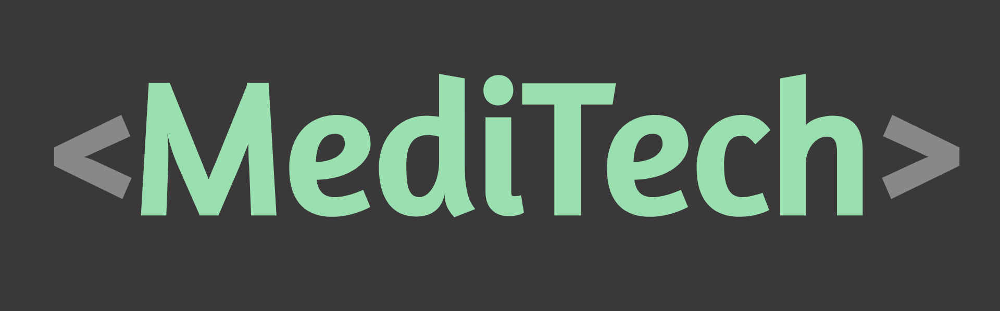
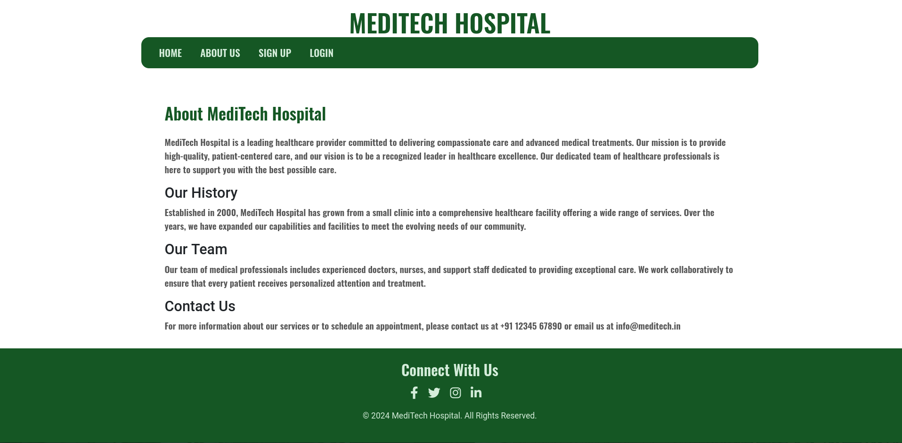
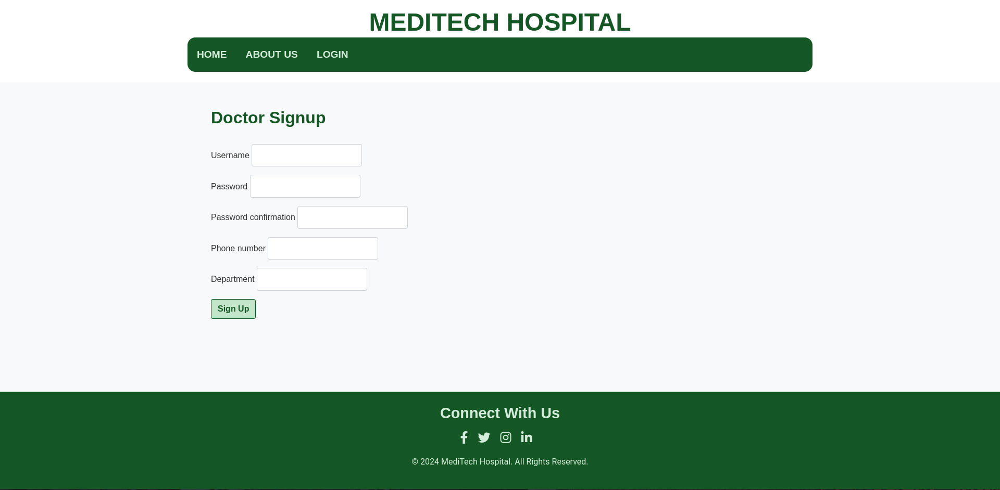

## MediTech: Revolutionizing EMR with AI-Powered Speech Processing


**Team Name:** A & N Team

**Team Members:**

* **Afnan K Salal:** Backend Developer
* **Navaneeth V Vinod:** Frontend Developer

### 1. Abstract

MediTech is an innovative AI-driven Electronic Medical Record (EMR) system designed to streamline and enhance clinical documentation for medical professionals. Recognizing the time-consuming and error-prone nature of traditional manual data entry in EMR systems, MediTech leverages state-of-the-art speech recognition, natural language processing, and the Anthropic API. This enables doctors to dictate patient consultations, have them automatically transcribed and translated, and extract key medical information for seamless integration into patient records. The system also offers preliminary treatment suggestions based on the extracted data, aiding in informed decision-making. MediTech aims to significantly reduce administrative burdens on physicians, enhance patient care through more focused interaction, and improve overall data insights for better diagnoses and treatment planning.

### 2. Problem Statement

Traditional Electronic Medical Record (EMR) systems heavily depend on manual data entry, which poses significant challenges:

* **Time-Consuming:** Doctors spend a considerable amount of time on data entry, taking away from valuable time that could be dedicated to patient care.
* **Error-Prone:**  Manual data entry is susceptible to human error, potentially leading to inaccurate or incomplete medical records. 
* **Physician Burnout:** The tedious and repetitive nature of documentation contributes to physician burnout, negatively impacting job satisfaction and patient care quality.
* **Lack of Contextual Understanding:** Existing speech recognition solutions often struggle to accurately transcribe complex medical terminology and lack the ability to extract meaningful medical information from conversational speech.

### 3. Proposed Solution

MediTech provides a comprehensive solution to these challenges by leveraging AI-powered speech processing and a user-friendly interface:

1. **User Authentication:** A secure login system using Django's authentication framework ensures authorized access for medical professionals. 
2. **Patient Details Input:** The frontend allows doctors to enter patient information via an intuitive form.
3. **Speech Input:** MediTech supports two methods for audio input:
    * **Direct Recording:** Doctors can initiate audio recording directly within the browser using a dedicated button and their device's microphone.
    * **File Upload:** Doctors can upload existing WAV audio files of consultations.
4. **Speech Recognition & Translation:** The uploaded or recorded audio is processed by powerful speech recognition models (OpenAI Whisper), transcribing the consultation into text. If the language is detected as Malayalam, it is automatically translated into English.
5. **EMR Data Extraction:**  The Anthropic Claude 2.1 model, accessed through the Anthropic API, analyzes the transcribed text to extract relevant EMR data points:
    * **Disease:** Identified medical conditions.
    * **Allergy:** Any mentioned allergies.
    * **Timeline:** Dates, durations, and time-related medical information. 
    * **Medical History:** Past medical conditions, treatments, or relevant procedures.
6. **Treatment Suggestions (Beta):** Claude 2.1 also provides preliminary treatment and medication suggestions based on the extracted EMR data.
7. **Report Generation & Download:** The frontend displays the transcription, translation (if done), extracted EMR data, and suggestions in a well-structured format. Doctors can then download a comprehensive report as a text file. 

### 4. File Structure

**Frontend (Django):**

```
meditech/
├── app/
│   ├── templates/
│   │   ├── app/
│   │   │   ├── index.html
│   │   │   ├── about.html
│   │   │   ├── record.html
│   │   │   ├── login.html
│   │   │   └── signup.html
│   ├── static/
│   │   ├── app/
│   │   │   ├── css/
│   │   │   │   └── styles.css
│   │   │   └── js/
│   │   │       ├── carousel.js
│   │   │       └── record.js 
│   ├── __init__.py
│   ├── admin.py
│   ├── apps.py
│   ├── models.py
│   ├── forms.py
│   ├── views.py
│   ├── authentication.py
│   ├── urls.py
│   ├── tests.py
│   └── context_processors.py
├── meditech/
│   ├── __init__.py
│   ├── asgi.py
│   ├── settings.py 
│   ├── urls.py
│   ├── wsgi.py
└── manage.py 
```

**Backend (Sanic):**

```
sin01/
└── backend/
    └── main.py
```

### 5. Technologies Used

* **Programming Languages:**
    * **Python:**  The primary language used for both the frontend (Django) and backend (Sanic) development.

* **Frameworks:**
    * **Django (Frontend):** A high-level Python web framework known for its ease of use, security features, and suitability for rapid development of robust web applications.
    * **Sanic (Backend):** A high-performance asynchronous web framework chosen for its speed and efficiency in handling audio processing requests. 

* **Libraries:**
    * **Transformers Library (Hugging Face):**  Provides access to pre-trained, state-of-the-art models for speech recognition (OpenAI Whisper) and translation (Helsinki-NLP).
    * **Langdetect:**  Enables automatic language detection, crucial for determining if translation is needed.
    * **Librosa:**  Used for audio loading, processing (e.g., resampling), and manipulation.
    * **Requests:**  Facilitates making HTTP requests to the backend API from the frontend.

* **API:**
    * **Anthropic API:**  Provides access to the Claude 2.1 language model, which is the core of MediTech's intelligent data extraction and suggestion generation capabilities.

* **AI Models:**

    * **Speech Recognition:**
        * **OpenAI Whisper (Small):** `openai/whisper-small` -  A general-purpose English speech recognition model.
        * **OpenAI Whisper (Small, Malayalam):** `kavyamanohar/whisper-small-malayalam` - A fine-tuned version of Whisper for Malayalam.
    * **Translation:**
        * **Helsinki-NLP/opus-mt-ml-en:** A machine translation model for converting Malayalam to English.
    * **EMR Data Extraction & Suggestions:**
        * **Anthropic Claude 2.1:** Accessed through the Anthropic API. This powerful language model is used for:
            * Extracting structured EMR data (disease, allergy, timeline, medical history) from the transcribed text.
            * Generating preliminary treatment and medication suggestions based on the extracted EMR data (beta feature). 

### 6. Workflow and Function Explanation

#### 6.1. Frontend Workflow

1. **User Authentication (views.py):**
    * **signup() function:** Handles user registration, form validation, password hashing, user creation, and login after successful registration.
    * **user_login() function:**  Manages user login, authenticating credentials against the Django user database. 
    * **logout_view() function:** Logs the user out and redirects them to the home page.
2. **Navigation (urls.py):** 
    * Defines URL patterns for the frontend, mapping URLs to corresponding views. 
3. **Templates (templates/app/):**
    * **index.html:**  The home page, providing an overview of MediTech.
    * **about.html:**  Gives additional information about the project.
    * **record.html:** The core page for audio recording, upload, processing, and report display. It includes:
        * Patient details form (currently not saved to a database).
        * Audio recording functionality (using JavaScript and the browser's MediaRecorder API).
        * Audio file upload option.
        * Logic for sending recorded/uploaded audio to the backend API using AJAX.
        * Display of processing results (transcription, translation, EMR data, suggestions) after the backend responds.
        * Download report functionality.
    * **login.html:** The login form.
    * **signup.html:** The user registration form. 
4. **Static Files (static/app/):**
    * **css/styles.css:** Contains the CSS styling for the frontend.
    * **js/carousel.js:**  Implements the image carousel functionality on the home page.
    * **js/record.js:**  Handles the logic for audio recording, file upload, AJAX requests, and displaying results on the record.html page.

#### 6.2. Backend Workflow (main.py)

1. **API Endpoint `/asr` (POST Request):** This endpoint receives audio files from the frontend and processes them. 
2. **Language Detection:** The `detect()` function from the Langdetect library analyzes a snippet of the transcribed text to determine the language (English or Malayalam).
3. **Speech Recognition:** Based on the detected language, the appropriate Whisper model is selected (`pipe_en` for English, `pipe_ml` for Malayalam), and the audio is transcribed using the `pipeline` from the Transformers library.
4. **Translation (if required):** If the language is Malayalam, the transcribed text is translated into English using the `Helsinki-NLP/opus-mt-ml-en` model from the Transformers library. 
5. **EMR Data Extraction:** 
    * The `extract_emr()` function uses the Anthropic Claude 2.1 model (accessed via the Anthropic API) to analyze the transcribed text and extract relevant EMR data. 
    * A carefully crafted prompt is sent to the Claude 2.1 model, instructing it to identify and structure key EMR elements (disease, allergy, timeline, medical history).
    * The response from Claude 2.1 is parsed to extract the EMR data in JSON format.
6. **Treatment Suggestion Generation (Beta):**
    * The `generate_suggestions()` function also uses Claude 2.1 with a prompt that asks for treatment and medication suggestions based on the extracted EMR data.
    * The suggestions are returned in JSON format.
7. **Response:**  The backend sends a JSON response to the frontend containing:
    * The original transcription.
    * The English translation (if done).
    * The structured EMR data.
    * The generated treatment suggestions.
  

### 7. Screenshots - Frontend

1. Home Page:
   
   
2. About Us Page:
  

3. Record Audio Page:
  

4. Login Page:
  

5. Sign Up Page:
  

### 8. Screenshots - Backend

1. Output:
   
   

### 9. Demo

https://github.com/user-attachments/assets/cd5e19e1-6330-43f1-8250-0d8eb39b7572


### 10. Conclusion

MediTech demonstrates a practical application of AI in healthcare, significantly automating the process of clinical documentation. By incorporating advanced speech recognition, translation, and the powerful capabilities of the Anthropic Claude 2.1 model, MediTech creates a system that can save doctors time, reduce errors, and ultimately enhance patient care.  As the project continues to evolve, it holds immense potential for further integration into existing healthcare workflows and for further refinement of its AI-powered features.  

