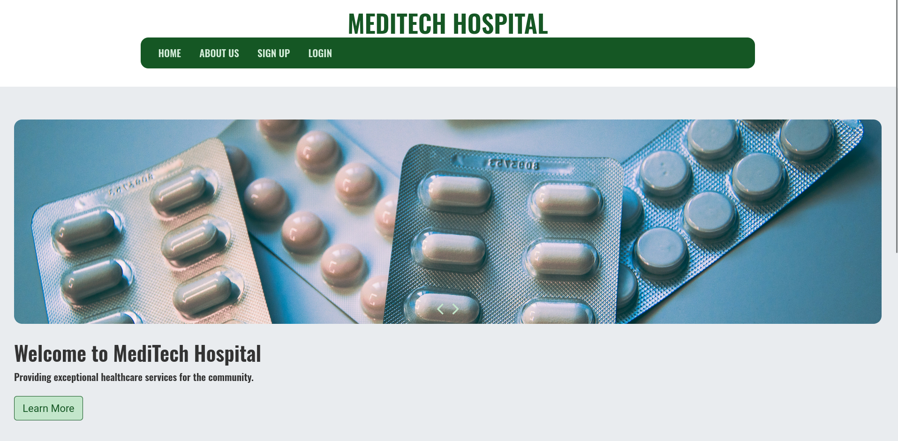
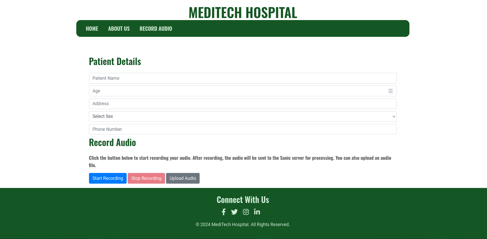
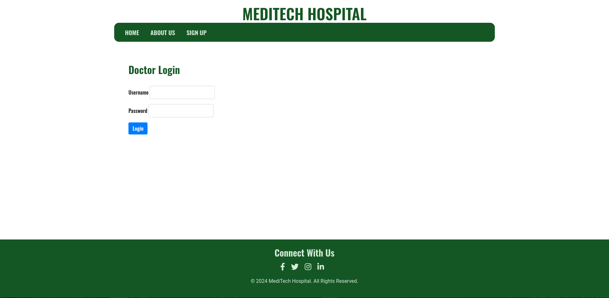

## MediTech: Revolutionizing EMR with AI-Powered Speech Processing

### Introduction

MediTech was developed during the SINOVA 24 hackathon, held at SCMS College, Muttom, with the goal of providing an innovative solution to the challenges faced in healthcare documentation. This 24-hour hackathon tasked us with creating a tool that could streamline the Electronic Medical Record (EMR) process, utilizing AI audio processing to assist medical professionals. 

Traditional EMR systems require manual data entry, which is time-consuming and prone to errors. This can lead to physician burnout and detracts from patient care. MediTech tackles these issues head-on by integrating advanced AI technologies to transcribe consultations, translate where necessary, and extract key medical data for seamless documentation. The system also provides treatment suggestions, which assists doctors in making informed decisions efficiently. 

MediTech's ultimate aim is to improve healthcare workflows by reducing the administrative burden on doctors and allowing them to focus more on patient interaction, thereby enhancing the overall quality of care.

### Key Features

1. **User Authentication:** Secured access for medical professionals using Django's authentication system.
2. **Patient Information Input:** A user-friendly form to capture patient details on the frontend.
3. **Audio Input:** Doctors can either:
   * Record consultations directly via the browser.
   * Upload audio files in WAV format for processing.
4. **Speech Recognition & Translation:** Audio is transcribed using OpenAI Whisper. If Malayalam is detected, it is automatically translated to English.
5. **EMR Data Extraction:** The Anthropic Claude 2.1 model extracts crucial information, including:
   * Diseases
   * Allergies
   * Timelines
   * Medical history
6. **Preliminary Treatment Suggestions (Beta):** Claude 2.1 also generates treatment recommendations based on the extracted data.
7. **Report Generation:** Doctors can download detailed reports of the transcribed, translated (if applicable), and analyzed data.

### File Structure

**Frontend (Django):**

```
meditech/
├── app/
│   ├── templates/
│   │   ├── app/
│   │   │   ├── index.html
│   │   │   ├── about.html
│   │   │   ├── record.html
│   │   │   ├── login.html
│   │   │   └── signup.html
│   ├── static/
│   │   ├── app/
│   │   │   ├── css/
│   │   │   │   └── styles.css
│   │   │   └── js/
│   │   │       ├── carousel.js
│   │   │       └── record.js 
│   ├── __init__.py
│   ├── admin.py
│   ├── apps.py
│   ├── models.py
│   ├── forms.py
│   ├── views.py
│   ├── authentication.py
│   ├── urls.py
│   ├── tests.py
│   └── context_processors.py
├── meditech/
│   ├── __init__.py
│   ├── asgi.py
│   ├── settings.py 
│   ├── urls.py
│   ├── wsgi.py
└── manage.py 
```

**Backend (Sanic):**

```
sin01/
└── backend/
    └── main.py
```

### Technologies Used

* **Frontend Framework:** Django
* **Backend Framework:** Sanic (for high-performance audio processing)
* **Speech Recognition Models:**
    * OpenAI Whisper (Small for English)
    * Whisper small fine-tuned for Malayalam (`kavyamanohar/whisper-small-malayalam`)
* **Translation Model:** Helsinki-NLP/opus-mt-ml-en (for Malayalam to English)
* **EMR Data Extraction & Treatment Suggestions:** Anthropic Claude 2.1 API
* **Additional Libraries:** Librosa (audio processing), Langdetect (language detection), Requests

### Workflow

1. **Frontend Workflow:**
    * Users authenticate using Django's login/signup forms.
    * Doctors fill in patient details via an intuitive form.
    * Audio recordings or file uploads are handled on the frontend using JavaScript and the MediaRecorder API.
    * Results (transcription, translation, extracted EMR data) are displayed and can be downloaded in a structured report.
  
2. **Backend Workflow:**
    * Audio files are sent via AJAX to the backend API, where Sanic processes the request.
    * The language of the transcription is detected using Langdetect, and the appropriate Whisper model is selected.
    * If Malayalam is detected, the transcription is translated into English.
    * The Anthropic Claude 2.1 model extracts structured EMR data and generates preliminary treatment suggestions.
    * The processed data is returned to the frontend for display and report generation.

### Screenshots

1. **Home Page:**
   
   
2. **Record Audio Page:**
   

3. **Login Page:**
   

### To-Do List

1. **Implement a Patient Database:** To store and manage patient records for easier retrieval and follow-ups.
2. **Refine Treatment Suggestions:** Improve the accuracy and scope of the suggestions provided by the Claude 2.1 model.
3. **Enhanced UI/UX:** Polish the user interface for a more streamlined and visually appealing experience.
4. **Real-Time Speech Recognition:** Add real-time transcription functionality for more interactive consultations.
5. **Multi-Language Support:** Expand language support beyond Malayalam and English to cater to a wider audience.
6. **API Integration:** Build an API for seamless integration with existing hospital systems.
7. **Improve Error Handling:** Strengthen error handling for better user feedback in case of faulty audio or issues during transcription.
8. **User Dashboard:** Implement a dashboard where users can view past reports, upload files, and track patient history.
9. **Custom Speech Models:** Train models fine-tuned for medical terminology to improve recognition accuracy.

### Conclusion

MediTech represents a significant leap forward in simplifying the documentation process for healthcare providers by using AI-powered technologies. The system is designed to reduce physician workload, enhance patient care, and make healthcare documentation more efficient. As the project evolves, it has immense potential for deeper integration into existing healthcare workflows and continued enhancement of its AI capabilities.
