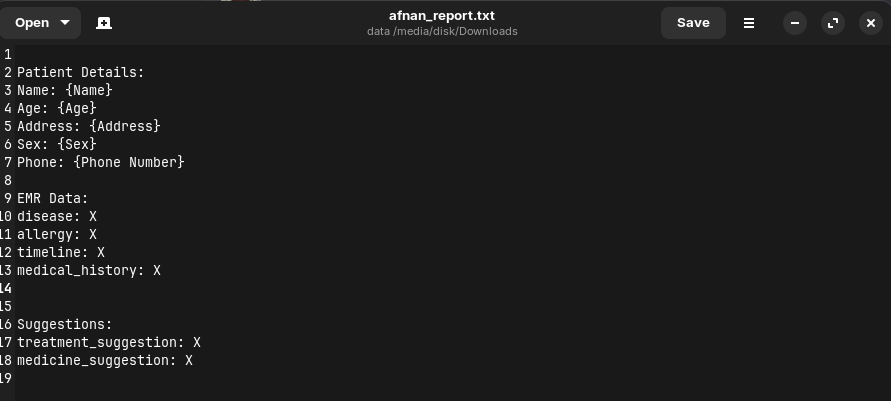

## MediTech Backend: 

This folder contains the backend code for MediTech, an AI-powered Electronic Medical Record (EMR) system. It handles audio processing, speech recognition, translation, EMR data extraction, and suggestion generation.

### Prerequisites

* **Python 3.7+**
* **pip (Python package installer)**
* **FFMPEG:** Required for audio processing. Installation instructions vary by operating system. For example, on Ubuntu/Debian:
    ```bash
    sudo apt-get update
    sudo apt-get install ffmpeg
    ```

### Installation

1. **Clone the repository:**
   ```bash
   git clone <repository_url>
   ```

2. **Navigate to the backend directory:**
   ```bash
   cd <folder_name>
   ```

3. **Create and activate a virtual environment (recommended):**
   ```bash
   python3 -m venv venv
   source venv/bin/activate
   ```

4. **Install backend dependencies:**
   ```bash
   pip install -r requirements.txt
   ```

### Configuration

* **Anthropic API Key:**
    1. Obtain an API key from [https://www.anthropic.com/](https://www.anthropic.com/).
    2. Create a `.env` file and set add a variable `ANTHROPIC_API_KEY` as the api key.

### Running the Backend

1. From the `backend` directory, start the Sanic server:
   ```bash
   python main.py 
   ```

2. The backend API will be accessible at `http://0.0.0.0:8000/`.

### API Endpoints

* **`/asr` (POST):**
    * **Input:**
        * `audio` (file): WAV audio file of the consultation.
    * **Output:** JSON response containing:
        * `transcription`: The transcribed text (original language).
        * `translation`: The translated text (English).
        * `emr_data`: Extracted EMR data (disease, allergy, timeline, medical history).
        * `suggestions`: Treatment and medication suggestions.

### Screenshots

1. Output:
   
   
   
### Technologies Used

* **Python:** Backend programming language.
* **Sanic:** Asynchronous web framework.
* **Transformers Library (Hugging Face):** For speech recognition and translation models.
* **Langdetect:** For language detection.
* **Anthropic API:** For EMR data extraction and suggestions using the Claude 2.1 model.
* **Librosa:** For audio loading and processing. 

### AI Models

MediTech utilizes the following AI models:

* **Speech Recognition:**
    * **OpenAI Whisper (Small):** `openai/whisper-small` -  A general-purpose English speech recognition model.
    * **OpenAI Whisper (Small, Malayalam):** `kavyamanohar/whisper-small-malayalam` - A fine-tuned version of Whisper for Malayalam.

* **Translation:**
    * **Helsinki-NLP/opus-mt-ml-en:** A machine translation model for converting Malayalam to English.

* **EMR Data Extraction & Suggestions:**
    * **Anthropic Claude 2.1:** Accessed through the Anthropic API. This powerful language model is used for:
        * Extracting structured EMR data (disease, allergy, timeline, medical history) from the transcribed text.
        * Generating preliminary treatment and medication suggestions based on the extracted EMR data (beta feature).
