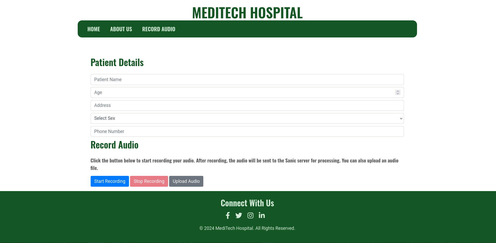
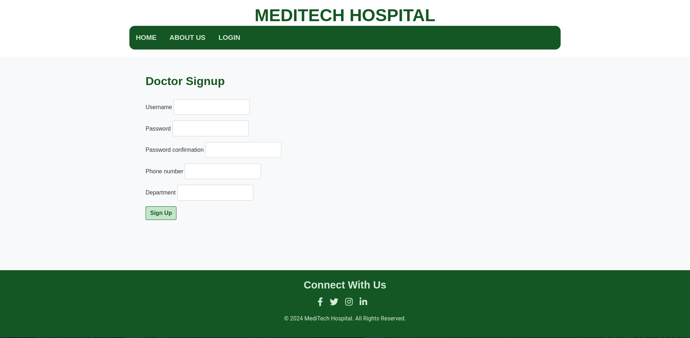

## MediTech Frontend: 

This folder contains the frontend code for MediTech, an AI-powered Electronic Medical Record (EMR) system. 

### Prerequisites

* **Python 3.7+**
* **pip (Python package installer)**

### Installation

1. **Clone the repository:**
   ```bash
   git clone <repository_url>
   ```

2. **Navigate to the frontend directory:**
   ```bash
   cd <folder_name>
   ```

3. **Create and activate a virtual environment (recommended):**
   ```bash
   python3 -m venv venv
   source venv/bin/activate
   ```

4. **Install frontend dependencies:**
   ```bash
   pip install django
   ```

### Configuration

No specific configuration is required for the frontend itself. However, ensure that the backend server is running and accessible at the URL specified in your frontend code (usually `http://0.0.0.0:8000/`).

### Running the Frontend

1. **Start the Django development server:**
   ```bash
   python manage.py runserver
   ```

2. **Open your web browser and navigate to the address provided by the development server (usually `http://127.0.0.1:8000/`).**

### Usage

1. **Home Page:** The home page provides an overview of MediTech.
2. **About Us Page:**  Learn more about MediTech and its mission.
3. **Sign Up Page:** Create a new doctor account.
4. **Login Page:**  Login to your doctor account.
5. **Record Audio Page (accessible after login):**
    * **Enter patient details**
    * **Record audio directly in the browser using the "Start Recording" and "Stop Recording" buttons.**
    * **Alternatively, upload a pre-recorded WAV audio file using the "Upload Audio" button.**
    * **Wait for the processing to complete (a loading indicator will be displayed).**
    * **View the transcription, translation (if applicable), extracted EMR data, and suggestions.**
    * **Download the report using the "Download Report" button.**
6. **Logout:** Log out of your doctor account.
  
### Screenshots

1. Home Page:
   
   
2. About Us Page:
  

3. Record Audio Page:
  

4. Login Page:
  

5. Sign Up Page:
  

### Technologies Used

* **Django:** Python web framework.
* **HTML, CSS, JavaScript:** Frontend development languages.
* **Bootstrap:** CSS framework for styling.
* **jQuery:** JavaScript library for DOM manipulation and AJAX requests.
